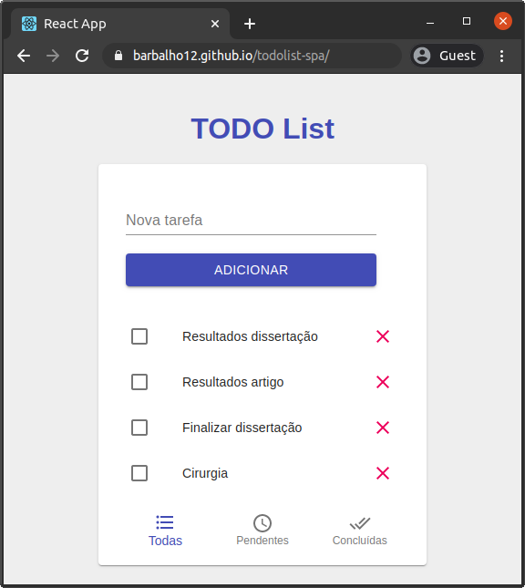

# TODO List - REACT

<p align="center"></p>

O serviço está diposnível no endereço https://barbalho12.github.io/todolist-spa

### Dependêcnias

* [todolist-backend](https://github.com/Barbalho12/todolist-backend) - Backend do sistema
* [Git](https://git-scm.com/downloads)
* [npm](https://www.npmjs.com/get-npm)
* [yarn](https://classic.yarnpkg.com/en/docs/install#debian-stable)


git commit -m "Finaliza descrição de configuração inicial do projeto"

### Executando localmente

Clone o projeto
```bash
git clone https://github.com/Barbalho12/todolist-spa.git
```

Acesse o diretório do projeto
```bash
cd todolist-spa
```

> **Observação**: Antes de executar verifique se o `PATH em src/API.js está apontando para o endereço onde o back está executando. 

Execute
```bash
yarn start
```

O serviço poderá ser acessado através do endereço [http://localhost:3000](http://localhost:3000)
